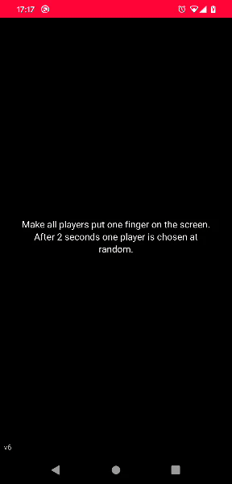

# Player Chooser

Player chooser web app. Every player places a finger on the screen. After 2 seconds the app picks one player at random. Helpful when choosing the starting player in a board game.



## Development

This project does not have any depencies or build steps. To start development, start a local webserver of your choice, serving the `src/` directory. Example with Python:

```sh
python3 -m http.server --directory src
```

After you've added/changed/deleted any file in the `src/` directory, please update the list of files in the Service Worker ([sw.js](./src/sw.js)) and increase the version. This will ensure that all users receive the update.
